<p align="center">
    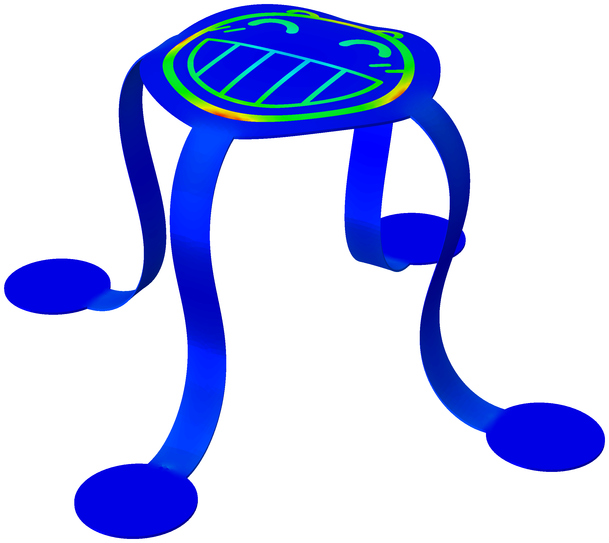
</p>

<h1 align="center">Buckling Assembly - Abaqus</h1>

<p align="center">
    <em>A comprehensive guide to automated FEA of buckling-guided 3D assembly with Abaqus.</em>
</p>

## Motivation

[Buckling-guided 3D assembly](https://doi.org/10.1126/science.1260960) is often described as a "promising technology" in micro/nano manufacturing, using the buckling of planar shells to create 3D structures. Some even call it revolutionary for enabling efficient fabrication of complex 3D microstructures with high-performance electronic materials like single-crystal silicon. In reality, though, buckling-guided assembly offers little practical value. Yet, papers on this topic keep appearing in top journals such as *Nature* and *Science*, much to the benefit of those so-called "scientists".

During my PhD, I was tasked with studying buckling-guided assembly -- a complete waste of time. To avoid spending endless hours running pointless FEA of these assembled "intriguing" 3D structures, I used my technical skills to automate the process and show that I could still deliver rigorous, high-quality work, even when faced with these absurd tasks. In this repository, I share Abaqus Python scripts for simulation of various buckling-guided assembly schemes. The scripts are general, readable, and easily adaptable to other needs -- should you ever find yourself in a similar situation.

## Classical buckling assembly simulation

This section describes the most widely used approach for simulating buckling-guided assembly, referred to here as the **classical buckling assembly simulation**. In this method, the substrate is not explicitly modeled. Instead, displacement boundary conditions are applied directly to the bonding regions, moving them to their desired positions. The assembly process is simulated using standard static analysis, with small disturbances introduced to the precursor structure to trigger buckling.

You can find the main script and all required data files for classical buckling assembly in the `classical` directory of this repository.

> And if you've ever heard the term "four-step method" for simulating buckling assembly, just ignore it. It's an incredibly inefficient approach that forces you to manually tweak the disturbance and loading for every single simulation. Who came up with this nonsense? Who knows. The scripts in this repository use a much more standard and efficient approach.

### Automatic FEA modeling and simulation

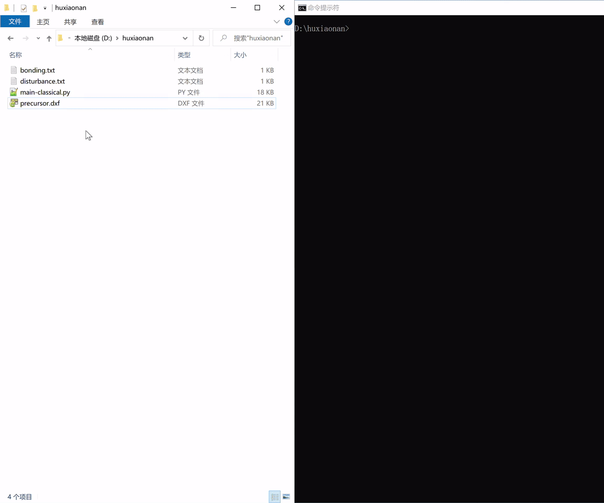

1. **Prepare the required files in a directory**

    - `main-classical.py`: Main simulation script.
    - `precursor.dxf`: DXF file of the precursor geometry.
    - `bonding.txt`: Text file specifying bonding regions.
    - `disturbance.txt`: Text file specifying disturbance.

2. **Modify the `main-classical.py` script**

    Set the required parameters such as shell thickness, material properties, mesh size, and assembly parameters. All parameters are defined in uppercase at the beginning of the script and are well-commented.

3. **DXF file requirement** 

    The `precursor.dxf` file should include only lines and arcs. Entities like polylines, splines, or hatches are not supported by the Abaqus DXF interface and will be ignored. Ensure that all lines and arcs together form one or more simple closed paths, with no self-intersections.

4. **Data file for bonding regions**

    Here is an example of a `bonding.txt` file:

    ```plaintext
    # Bonding regions data file
    #
    # This file defines the regions used for bonding.
    #
    # Supported bonding shapes: circular and rectangular.
    #
    # Circular bonding format:
    #
    #   CIRCLE {XC} {YC} {R} [ROTATABLE]
    #
    #   where XC, YC is the center coordinate of the circle and R is the radius.
    #
    # Rectangular bonding format:
    #
    #   RECT {X1} {Y1} {X2} {Y2} [ROTATABLE]
    #
    #   where (X1, Y1) and (X2, Y2) are the coordinates of the opposite corners of
    #   the rectangle.
    #
    # The optional ROTATABLE keyword specifies if the bonding allows rotation about
    # the Z-axis. If omitted, rotation is not permitted.

    CIRCLE 1 0 0.1
    CIRCLE 0 1 0.1
    CIRCLE -1 0 0.1
    CIRCLE 0 -1 0.1
    RECT -0.1 -0.1 0.1 0.1
    ```

    Lines starting with `#` are comments and will be ignored by the script. Each non-comment line specifies a bonding region, which can be either circular or rectangular.

    The optional `ROTATABLE` keyword determines whether the bonding region is allowed to rotate in the xy plane. For more details on how bonding regions are implemented in the simulation, see [the section below](#rotatable-and-non-rotatable-bonding-regions).

5. **Data file for disturbance**

    An example of the `disturbance.txt` file is like

    ```plaintext
    # Disturbance data file
    #
    # This file defines the disturbance locations and orientations.
    #
    # Each line specifies a disturbance point.
    #
    # Disturbance format:
    #
    #   {X} {Y} {DEFLECTION}
    #
    #   where (X, Y) is the coordinate of disturbance location, and DEFLECTION is
    #   the normalized out-of-plane displacement at that point. Use 0, 1, or -1
    #   for DEFLECTION; do not enter actual displacement values. The program will
    #   automatically scale the disturbance according to the shell thickness.

    0.5 0 1
    0 0.5 1
    -0.5 0 1
    0 -0.5 1
    ```

    Lines starting with `#` are comments and will be ignored by the script. Each non-comment line specifies a disturbance location in the precursor.

6. **Build the model**

    Run the following command in a terminal

    ```bash
    cd /path/to/your/directory
    abaqus cae script=main-classical.py
    ```

    Or, to run without the GUI:

    ```bash
    abaqus cae noGUI=main-classical.py
    ```

    This will generate the following files:

    - `Job-1.inp`: Abaqus input file for simulating the disturbed precursor.
    - `Job-2.inp`: Abaqus input file for simulating the buckling assembly process.
    - `model.cae`: Abaqus CAE file containing both models.

7. **Run the two jobs in sequence**

    `Job-1` introduces a small out-of-plane disturbance to the precursor, creating an "imperfect" geometry. This imperfection is essential for initiating out-of-plane buckling in `Job-2`. As a result, you must complete `Job-1` before running `Job-2`.

    Use the following command lines to run the two jobs:

    ```bash
    abaqus job=Job-1 interactive
    abaqus job=Job-2 interactive
    ```

    - **Job-1:** The disturbed configuration  
        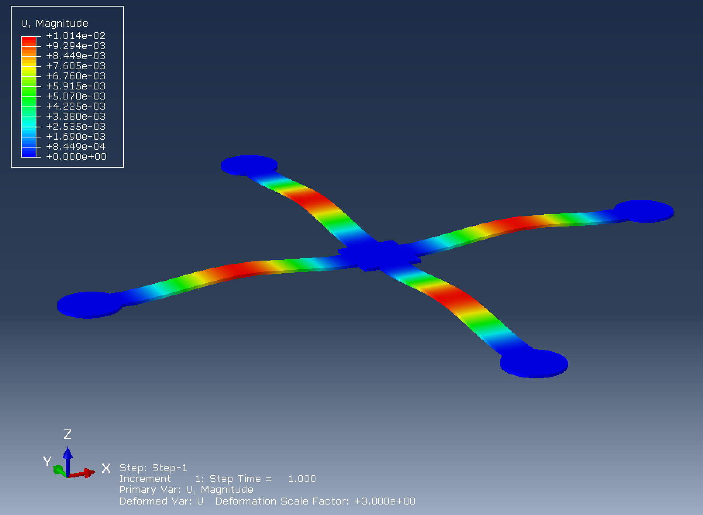

    - **Job-2:** Buckling-guided assembly  
        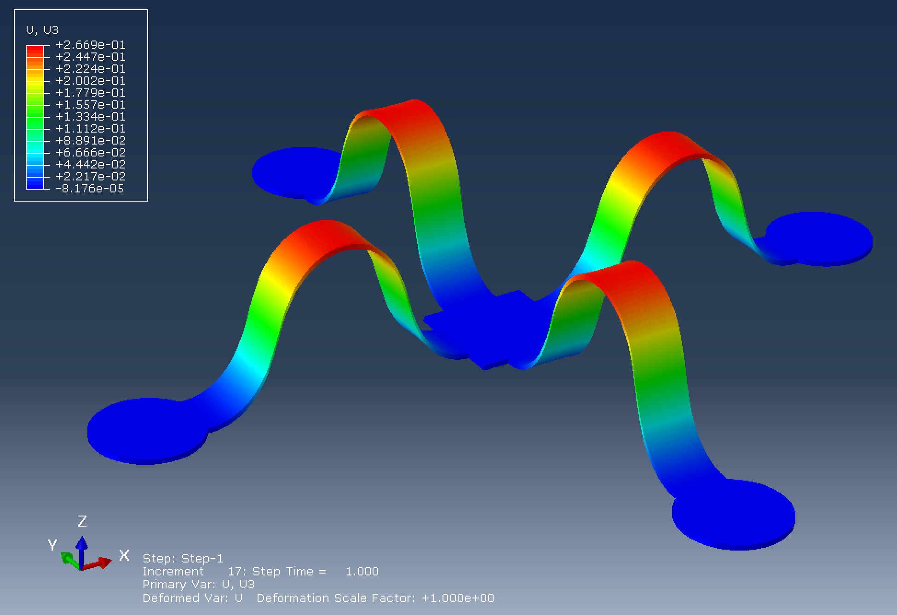

    **Important**: Do not click the "Submit" button in the Abaqus CAE job manager to run these two jobs. Always submit the jobs from the command line as described above. This is because both generated input files (`Job-1.inp` and `Job-2.inp`) have been modified by my script to include additional keywords for geometric imperfections, which are not supported by Abaqus CAE. Submitting the jobs through the GUI will overwrite these modifications.

    **Tips**: `Job-1` runs quickly since NLGEOM is not enabled, so using multiple processors offers little benefit. `Job-2` can take much longer. For large models (with over 100,000 elements), running `Job-2` with multiple processors can help speed up the simulation.

### Interactive FEA modeling with Abaqus macros

The main script also supports interactive modeling, allowing you to build and modify the model interactively within the Abaqus CAE GUI. This approach is useful for debugging, customizing meshing strategies, or adding features such as contact or tie constraints. Interactive modeling is accomplished using Abaqus macros.

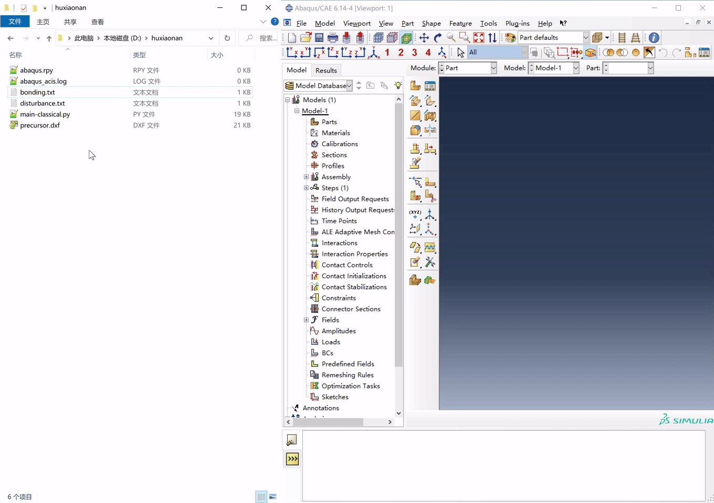

1. **Prepare the required files**

    - `main-classical.py`: Main simulation script.
    - `precursor.dxf`: DXF file of the precursor geometry.
    - `bonding.txt`: Text file specifying bonding regions.
    - `disturbance.txt`: Text file specifying disturbance.

    These files follow the same rule as described in the automatic assembly simulation section.

2. **Rename the main script**

    Rename `main-classical.py` to `abaqusMacros.py`. Abaqus recognizes this filename as macros, allowing the functions defined in the script to be executed directly from the GUI.

3. **Run script functions in the GUI**

    Open Abaqus CAE and set the working directory to your project folder (**File > Set Work Directory**). Then, navigate to **File > Macro Manager** to view the functions defined in `abaqusMacros.py`. Select the desired function and click **Run** to execute it. The function will operate on the current model within the GUI, allowing you to interactively build or modify your simulation.

4. **Run the jobs**

    **Important**: After building the model, do not use the "Submit" button in the Abaqus CAE job manager to run the jobs. Instead, use the functions `M1090_create_and_modify_job_1_inp()` and `M2040_create_and_modify_job_2_inp()` from the macro manager to generate the required input files. Then, run these jobs from the command line as described above. These two functions will generate the input files with the necessary keywords for geometric imperfections, which are not supported by Abaqus CAE and are not recorded in CAE model. Submitting the jobs through the job manager will overwrite these modifications.

### Modeling details

#### Introducing geometric imperfections into the model

Abaqus solves postbuckling problems using a two-job approach. In the first job, it performs a static, Riks, or linear buckling analysis to determine the buckling mode. Then, in the second job, the buckling mode is used as a geometric imperfection to simulate the postbuckling behavior of the assembly.

However, Abaqus CAE does not support those keywords needed for geometric imperfections. The geometric imperfections can only be introduced by modifying the input files of the two jobs.

The simulation of buckling-guided assembly follows this two-job approach. Two models are created: `Model-1` for the disturbed precursor and `Model-2` which for the buckling assembly process. Correspondingly, `Job-1` and `Job-2` are generated from these models, respectively. The introducing of geometric imperfections is achieved by adding additional keywords to `Job-1.inp` and `Job-2.inp` files, as follows:

1. Edit `Job-1.inp` to include the `Node file` keyword inside the step definition. The `Node file` keyword is a step-level entry and must be placed within the relevant step block:

    ```plaintext
    *Step, name=Step-1, nlgeom=NO
    *Static
    ...
    *Node file
    U
    ...
    *End Step
    ```

    This keyword instructs Abaqus to output the nodal displacement of the precursor to a file named `Job-1.fil`.

2. Edit `Job-2.inp` to include the `Imperfection` keyword before any step definition. The `Imperfection` keyword is a model-level entry and must be placed above the any `Step` block:

    ```plaintext
        *Imperfection, file=Job-1, step=1
        1, 1.0
        ...
        *Step, name=Step-1, nlgeom=YES
        ...
    ```

    The line `1, 1.0` specifies two values. The first value is the mode number and should be set to `1` when `Job-1` is a static analysis. The second value is the imperfection scaling factor. A value of `1.0` superimposes the displacement from `Job-1` onto `Job-2`'s initial configuration at its original scale. You can modify this factor if needed, but `1.0` works well in most cases.

**Note**: While it is possible to manually add these keywords in Abaqus CAE using **Model > Edit Keywords**, this approach is prone to issues, because subsequent modifications to the model may conflict with the inserted keywords. For this reason, the script chooses to directly edit the input files rather than relying on keyword editing within the CAE interface.

#### Sketching and meshing the precursor

The script is designed to be general, so it imports the precursor geometry from a DXF file. Alternatively, you can use Abaqus CAE's sketching tools to create and parameterize the precursor geometry directly within the script if you prefer.

The precursor is meshed with shell elements (S4R and S3). The script provides only the most basic global meshing options, which are controlled by three parameters: `MY_MESH_SEED_SIZE`, `MY_MESH_SEED_DEVIATION_FACTOR`, and `MY_MESH_SEED_MIN_SIZE_FACTOR`.

For more advanced or customized meshing strategies, consider using the interactive modeling workflow described above.

#### Node-based modeling scheme

All constraints and boundary conditions in this approach are applied directly to nodes, treating nodes as the primary entities rather than relying on geometric features. This node-based approach requires meshing the precursor before defining any constraints or boundary conditions. Since it does not depend on geometric partitions, the method is highly general and flexible.

While manually assigning node-based constraints can be tedious, the provided scripts automate this process efficiently. Note that any changes to the mesh will invalidate existing constraints and boundary conditions. To update them after remeshing, simply run the functions `M1070_create_model_1_bonding_bc()` and `M1080_create_model_1_disturbance_bc()` from the macro manager, as described in the interactive FEA modeling section. These functions will automatically regenerate all necessary constraints and boundary conditions based on the current mesh.

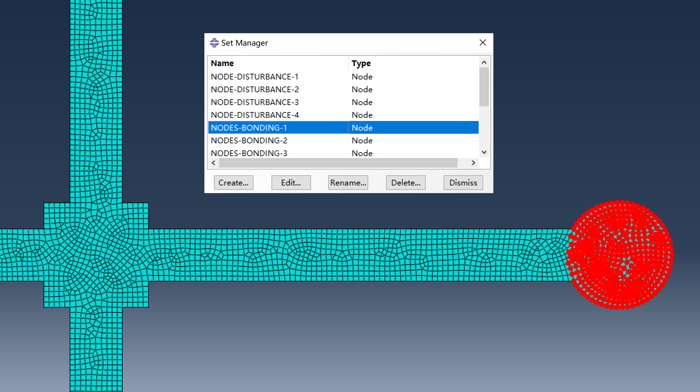

#### Introducing disturbance

In `Model-1`, disturbance is introduced by applying small out-of-plane displacement to specific nodes. For each disturbance location listed in `disturbance.txt`, the script identifies the closest node in the mesh and applies a displacement boundary condition in the z-direction (u3) at that node. The displacement magnitude is calculated by multiplying the "Z-displacement" value from `disturbance.txt` by the shell thickness parameter `MY_SHELL_THICKNESS` defined in the main script.

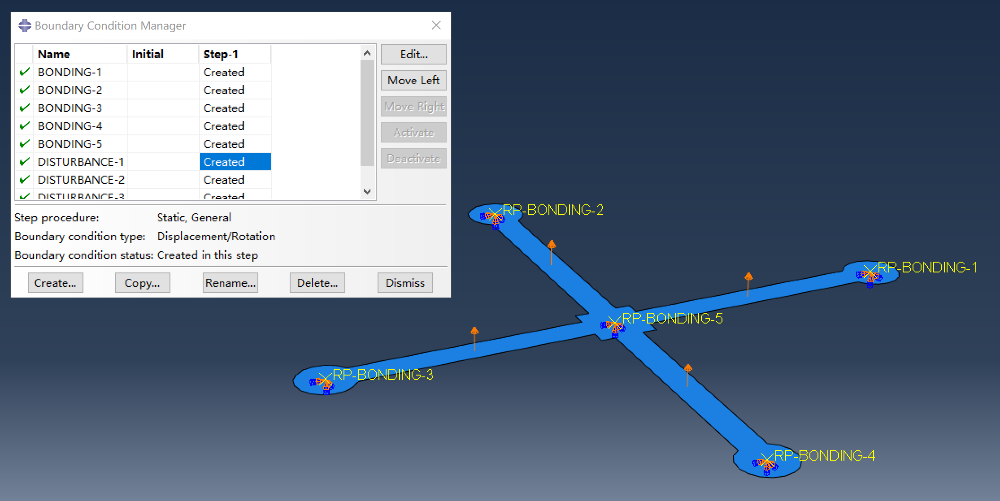

In `Model-2`, the disturbed configuration in `Job-1` serves as a geometric imperfection that is superimposed onto the initial configuration of `Job-2`, as detailed in the section on introducing geometric imperfections. The scaling of the disturbance applied in `Job-1` is controlled by the `MY_DISTURBANCE_SCALE_FACTOR` parameter in the main script.

#### Coupling constraints and boundary conditions for bonding regions

For each bonding region specified in `bonding.txt`, the script finds all nodes located within the bonding region and groups them into a set. It then creates a reference point at the centroid of the bonding region. A coupling constraint is applied between the reference point and the node set, ensuring that these nodes move as a rigid body with the reference point.

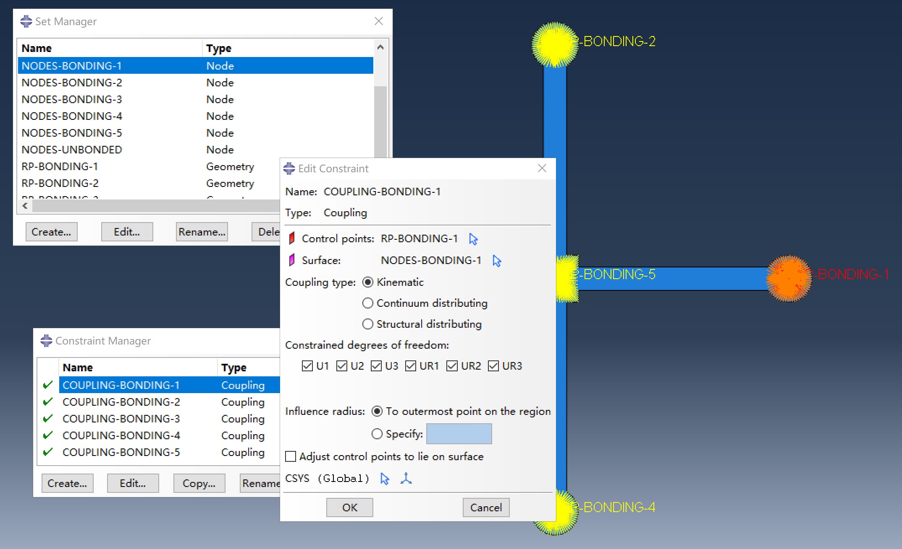

In `Model-1`, the reference points are fully fixed to ensure zero displacement when the precursor is disturbed. In `Model-2`, displacement boundary conditions are applied to the reference points. The required displacement for each bonding region is computed based on the initial positions of the reference points, using the parameters `MY_MODEL_2_SUBSTRATE_SHRINKAGE` and `MY_MODEL_2_SUBSTRATE_SHRINKING_CENTER` defined in the main script.

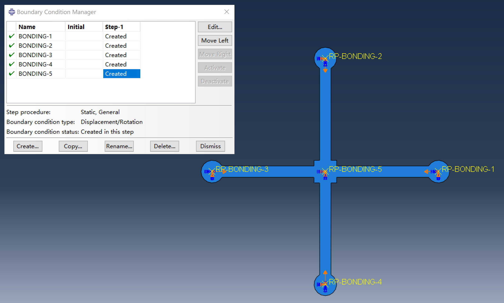

This script is tailored for classical buckling assembly involving biaxial substrate shrinkage. If you need to specify different shrinkage ratios along the *x* and *y* directions, you can adapt the script to allow separate values for each direction.

#### Rotatable and non-rotatable bonding regions

The script supports both rotatable and non-rotatable bonding regions, as specified in the `bonding.txt` file. For rotatable bonding regions, the rotational degree of freedom (ur3) at the reference point is left free, allowing the bonding regions to rotate freely in the *xy* plane during the assembly process. For non-rotatable bonding regions, the rotational degrees of freedom are fully fixed, preventing any rotation of the bonding region reference points.

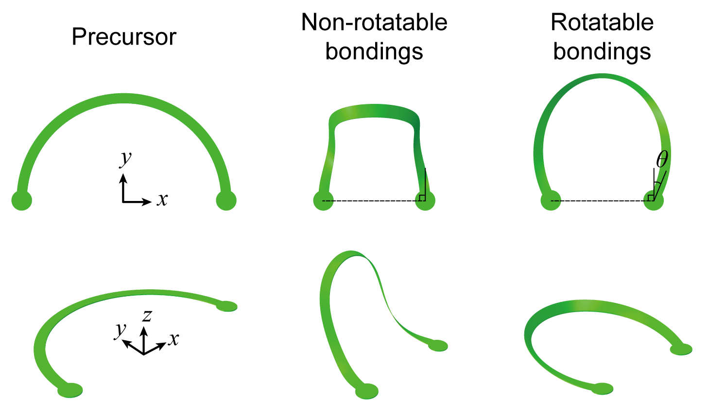

You might wonder when rotatable bonding regions are actually needed. In practice, almost never, since rotation is typically constrained by the substrate. However, the option is available if you wish to use it.

#### Output management

The script is designed to minimizes the size of the ODB files generated by both jobs by restricting output to only the essential field data. By default, no history outputs are included. If you require additional field or history outputs, you can adjust the script to customize the output settings as needed.

If you want to make an animation of the assembly process, remember to increase the number of output frames by setting the `MY_MODEL_2_FOUTPUT_NUM` parameter in the main script.

## Other simulation scenarios for buckling-guided assembly

### Attaching functional layers to assembled structures

Buckling assembly is often used to fabricate 3D structures with integrated functional layers, such as sensors or actuators. For such simulations, see [Attaching functional layers to assembled structures](./attachment/README.md).

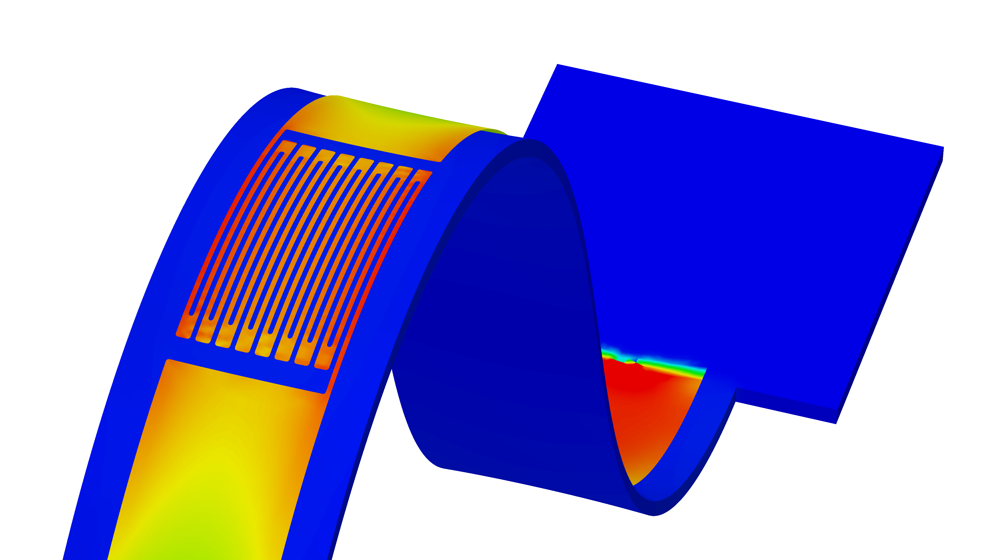

### Conforming assembled structures onto curved surfaces

Buckling-assembled 3D flexible structures can be conformed onto curved surfaces, which is important for applications in flexible electronics. For such simulations, see [Conforming assembled structures onto curved surfaces](./curved/README.md).

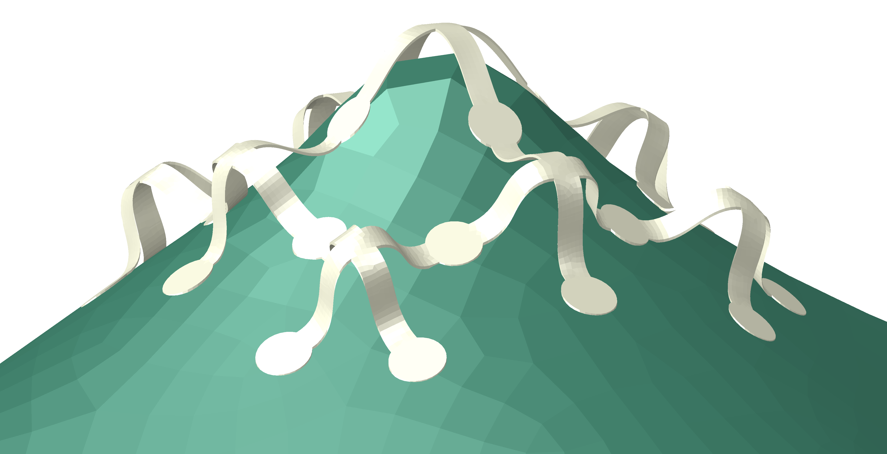

### Simulating buckling assembly of ultra-flexible structures

Ultra-flexible structures are extremely difficult to assemble due to its extremely low stiffness, which can also lead to convergence issues in FEA when using implicit analysis. Explicit dynamics analysis is used for such simulations, see [Simulating buckling assembly of ultra-flexible structures](./ultraflexible/README.md).

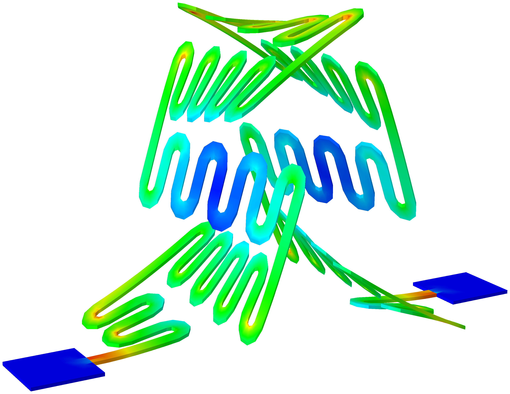

### Simulating buckling assembly with explicit substrate modeling

This simulation explicitly models the substrate, providing a more realistic representation of the assembly process. For such simulations, see [Simulating buckling assembly with explicit substrate modeling](./with_substrate/README.md).

TODO

### Buckling assembly with bilayer ribbon network

This assembly method was introduced in JPMS 2024.

TODO

### Buckling assembly considering interfacial adhesion

This assembly method takes into account the interfacial adhesion between the precursors and the substrate.

TODO

### Tensile buckling assembly of single-layer structures

This assembly method is to be introduced in Science Advances 2025.

TODO

### Tensile buckling assembly of multilayer structures

This assembly method is to be introduced in Science Advances 2025.

TODO

### Tensile behavior of serpentine structures

This simulation is targeted at a kind of serpentine ribbon structure with ultra-high stretchability. The simulation considers the interation with the substrate.

TODO
