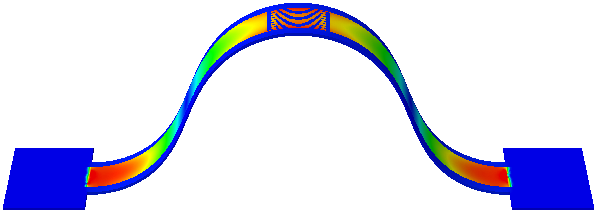
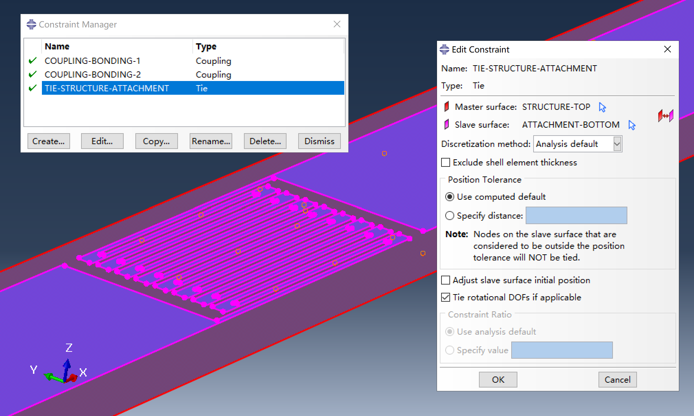

# Attaching functional layers to assembled structures

Buckling assembly is often used to fabricate 3D structures with integrated functional layers, like sensors or actuators. Simulating these assemblies with functional layers is mostly done to produce impressive visualizations for publications -- it's less about genuine mechanical analysis and more about filling space and demonstrating that the so-called "experts" in mechanics can run these simulations.

In this workflow, the simulation of the functional layer is added as an extra step: a patterned functional layer, represented as a thin shell, is tied to the precursor, and the process then proceeds as in the classical buckling assembly simulation.

## Interactive modeling workflow

Two scripts are used in this workflow: `main-classical.py` for the classical buckling assembly simulation, and `main-attachment.py` for creating the attachment.

Attachments, such as metallic layers with complex features like strain gauges, often require specialized meshing to ensure high-quality results. The `main-attachment.py` script provides only basic meshing capabilities. For optimal mesh quality, especially for intricate geometries, it is recommended to use interactive modeling in Abaqus CAE. This allows for manual partitioning and local mesh seeding, enabling greater control over the mesh refinement and overall simulation accuracy.

### Preparation

1. Ensure all files needed for classical buckling assembly simulation are available (`precursor.dxf`, `bonding.txt` and `disturbance.txt`).

2. Add `attachment.dxf` for the attachment geometry.

3. Adjust parameters in both scripts as needed.

### Steps

1. Rename `main-classical.py` to `abaqusMacros.py`.

2. Open Abaqus CAE and go to **File > Macro Manager**.

3. Run all "M1XX" functions except `M1090_create_and_modify_job_1_inp()`.

4. Rename `abaqusMacros.py` back to `main-classical.py`.

5. Rename `main-attachment.py` to `abaqusMacros.py`.

6. Click `Reload` in Macro Manager to load attachment macros.

7. Execute the functions in `main-attachment.py` to build the attachment step-by-step.

8. Rename `abaqusMacros.py` back to `main-attachment.py`.

9. Rename `main-classical.py` to `abaqusMacros.py` again.

10. Click `Reload` to reload the classical assembly macros.

11. Run `M1090_create_and_modify_job_1_inp()` to generate `job_1.inp`.

12. Execute "M2XX" functions to create `Model-2` and write `job_2.inp`.

    `M2000_clone_model_2_from_model_1` will clone `Model-1` to `Model-2`, so the attachment from `Model-1` will be included in `Model-2`.

13. As a good habit, rename `abaqusMacros.py` back to `main-classical.py` to avoid confusion in the future.

14. Run `job_1.inp` and `job_2.inp` from the command line.

    If `Job-2` fails to converge, consider enabling automatic stabilization as described in the notes below.

## Notes on simulation

When defining the tie constraint between the precursor (carrier structure) and the attachment, the carrier structure should be assigned as the **master** surface and the attachment as the **slave** surface. This is because the attachment typically has a finer mesh and lower stiffness. Displacement boundary conditions should be applied to the carrier structure (master surface), as the degrees of freedom for nodes on the slave surface are constrained. Any displacement boundary conditions applied to the slave surface will be ignored by Abaqus.

The attachment instance is positioned with an offset from the bottom layer of the carrier structure, controlled by the parameter `MY_ATTACHMENT_Z_OFFSET` in `main-attachment.py`. As a result, the tie option **Exclude shell element thickness** is enabled.

To prevent potential element distortion due to node adjustment, the tie option **Adjust slave surface initial position** is disabled. This choice is made for robustness; however, for improved accuracy, it is preferable to enable this option when a fine mesh is used.

In some cases, `Job_2` may experience convergence issues. One way to address this is by enabling automatic stabilization in the step definition. Choose either **Specify dissipated energy fraction** or **Specify damping factor**. There is no universal rule for the stabilization factor, and some trial and error is usually required. In practice, the default value of 0.0002 is often sufficient, but smaller values such as 1E-6 or 1E-8 can help achieve convergence without noticeably impacting results. It is generally advised **not** to enable the **Use adaptive stabilization...** option for buckling assembly simulations, as this can lead to large oscillations in the step increment size (continuous reduction followed by gradual increase), which slows down the simulation or causes it to fail.

## Notes on visualization

Abaqus CAE supports **Render shell thickness**, but this feature has a limitation: the thickness is always rendered along the initial normal direction of the shell element. When the shell undergoes significant rotation, the displayed thickness may not match the actual thickness in the deformed state. This can create the appearance of a gap between the attachment and the carrier structure. Regardless, this is purely a visualization issue and has nothing to do with simulation.
