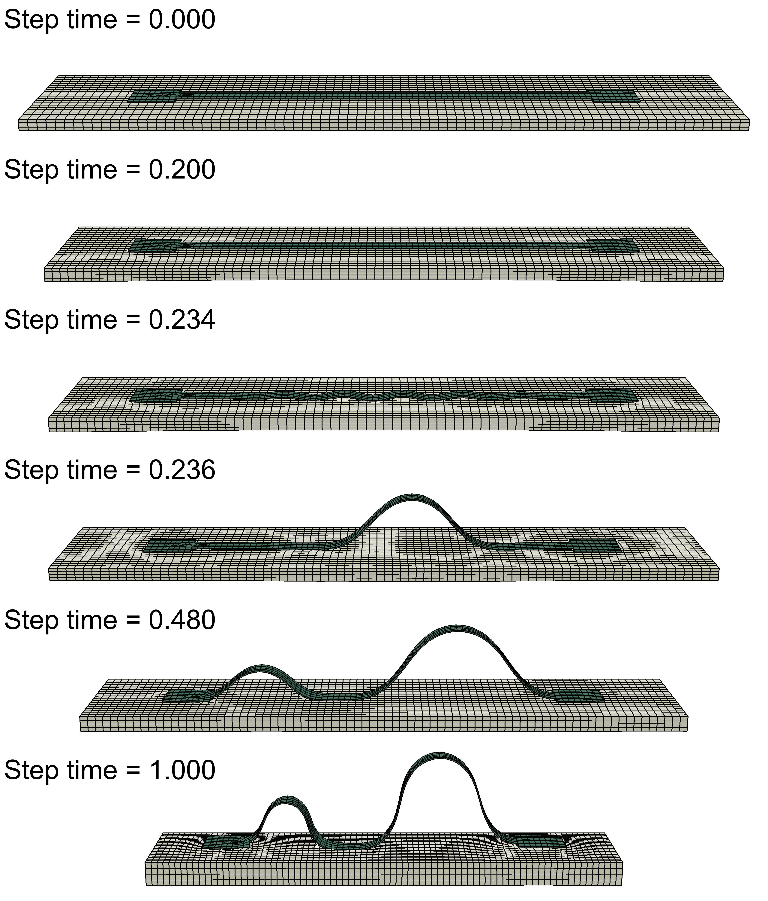
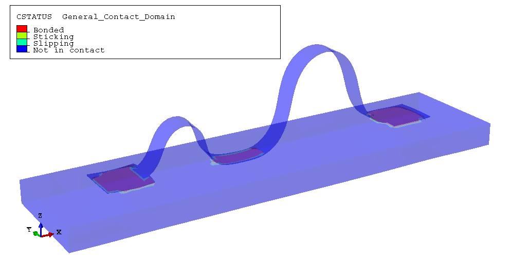

# Buckling assembly with cohesive behavior

This simulation is closely related to the [Substrate-included buckling assembly simulation](../with_substrate/README.md), but using dynamic explicit analysis with updated interaction settings to include cohesive behavior at the interface between the structure and the substrate.

Implicit static analysis is not used in this simulation for two main reasons. First, the softening response associated with interface debonding introduces significant convergence challenges for implicit solvers. Debonding typically manifests as a snap-through instability, where the crack propagates abruptly rather than in a controlled, gradual manner. Explicit dynamic analysis is more robust for handling such instabilities. Second, cohesive contact behavior is more compatible with general contact in explicit analysis. In implicit analysis, however, cohesive behavior is only compatible with surface-to-surface contact, making it less flexible.

> It is not entirely clear whether the cohesive damage model is an appropriate approach for simulating van der Waals interface. For reference, [PNAS 2019](https://doi.org/10.1073/pnas.1907732116) (this paper uses implicit static analysis somehow).

## Typical behavior during the assembly process

When the substrate is released, the structure is initially fully bonded to the substrate and retains nearly the same shape as its original form, restricting shrinkage at the bottom of the substrate.

As the substrate shrinks to a critical threshold, wrinkles appear suddenly, which is a typical response in membrane–substrate systems. The wrinkle wavelength is mainly determined by the bending stiffness of the structure and the elastic modulus of the substrate, and it stays nearly constant during this stage. As shrinkage continues, the wrinkle amplitude increases and the contact stress between the structure and substrate rises rapidly.

Once the normal contact stress reaches its maximum allowable value, debonding initiates and the structure begins to separate from the substrate. This process is known as crack propagation. Typically, the crack propagates in an unstable manner, with a finite segment of the structure abruptly detaching from the substrate. This crack propagation can occur within tens of microseconds, which is far shorter than the timescale of substrate shrinkage, and the inertia of the structure is significant in this process. Such behavior can only be captured by explicit dynamic analysis and will cause severe convergence issues in implicit static analysis.

When a segment of the structure detaches from the substrate, the stress in the substrate beneath this segment is suddenly released. This release allows other regions to relax, which can be observed by the disappearance of wrinkles in the still-bonded areas. As shrinkage continues and reaches another threshold, debonding occurs in these still-bonded regions. Generally, the length of the debonded structure increases in a stepwise manner.

## Details of the simulation

### Contact interactions

General contact (explicit) is used in this simulation, where individual properties are assigned to different regions of the model.

#### Contact properties for the bonding region

**Cohesive Behavior** is defined as the interaction property for the bonding region. Using rough contact in explicit analysis is never recommended; Abaqus will issue a warning if rough contact is used in explicit analysis and will advise using cohesive contact instead. In my experience, rough contact can cause severe mesh distortion in such simulations.

#### Contact properties for the non-bonding region

The following cohesive interaction settings are intended to approximate van der Waals bonding behavior. However, it should be noted that they do not precisely reproduce the behavior of real van der Waals bonding, and their effectiveness in representing the actual physical process is uncertain.

Four interaction properties are defined for the non-bonding region: the original normal "hard" and tangential "frictionless" behaviors are retained, and **Cohesive Behavior** and **Damage** are also specified to model the van der Waals bonding. Note that in this simulation, the normal "hard" and tangential "frictionless" behaviors are not strictly necessary and are retained mainly for clarity. Generally, these behaviors are important because cohesive behavior is only active under negative normal pressure, and tangential behavior becomes relevant after cohesive contact is damaged.

The option **Allow cohesive behavior during repeated post-failure contacts** is enabled in the cohesive behavior settings, allowing cohesive rebonding each time contact is established, even for slave nodes previously involved in cohesive contact that have fully damaged and debonded.

For the traction-separation behavior, the **Use default contact enforcement method** option is selected instead of manually specifying stiffness coefficients. With this option, Abaqus uses the default penalty method for contact enforcement, so no energy is stored in the cohesive interaction and the output variable ALLCCE is always zero. Notably, using the default penalty method in implicit analysis can sometimes lead to convergence issues when shear separation occurs, but in explicit analysis, this is not a problem.

Damage behavior is defined, specified with the maximum nominal stress criterion for damage initiation and separation-based linear damage evolution. This approach models the van der Waals forces that decrease as separation increases. The shearing component for damage initiation is set to a large value relative to the normal component (100 times larger as in the script), which ensures that damage is caused by pure normal separation. The maximum effective separation at complete failure is set to a nanometer to reflect the nature of van der Waals bonding.

Notably, when the default contact enforcement method is selected, Abaqus handles cohesive evolution in a particular way: because the critical displacement for damage initiation is zero, a singularity arises in the damage evolution calculation (see the Abaqus documentation on *Contact cohesive behavior*). As a result, the damage variable jumps immediately to one once the maximum contact stress is reached. However, even after the damage variable reaches one, Abaqus continues to apply contact force to the cohesive interaction until the separation criterion is satisfied. This behavior can be confusing when reviewing the output variables.

If the stiffness coefficients for the cohesive interaction are specified instead of using the default penalty method, the critical displacement for damage initiation will have a finite value, and the damage variable will evolve smoothly from zero to one as the contact separation increases. The relationship between damage and separation will follow a rational fractional relation as described in the Abaqus documentation. However, for simplicity, the default penalty method is used here.

Damage stabilization settings apply only to implicit analysis and are ignored in explicit analysis. So they are not specified in this simulation.

### Mesh controls

A finer mesh is required to accurately capture the cohesive behavior. It is recommended to use a small mesh size for both the structure and the substrate. However, a smaller mesh size leads to significantly longer simulation times in explicit analysis. Running the simulation with multiple processors can help improve performance.

### Damping

Rayleigh damping is specified in the material definitions for both the structure and the substrate. This approach helps suppress the oscillations caused by the abrupt debonding. Note that the choice of damping coefficients can influence the simulation outcomes, so you may need to adjust them according to your specific needs. Monitor the history output variable ALLVD in relation to other energy terms to ensure that the damping level lies within a reasonable range.

## Modeling workflow

1. Prepare all required input files: `main-with_substrate-exp.py`, `precursor.dxf`, and `bonding.txt`, as described in the substrate-included buckling assembly simulation.

2. Prepare the main script `main-cohesive.py`, modifying key parameters as needed.

3. Run `main-with_substrate-exp.py` to generate the base model.

    This script sets up an explicit dynamic analysis for the substrate-included buckling assembly, without cohesive behavior in the non-bonding region. It will produce an input file named `Job-1.inp`. If you do not need cohesive behavior at the non-bonding region, you can use this input file and run the job directly in Abaqus CAE or from the command line. If you wish to include cohesive behavior, ignore this generated input file and continue to the next step.

4. Run `main-cohesive.py` to update the model with cohesive behavior.

5. Regenerate the input file `Job-1.inp` by clicking "Write Input" in the Abaqus CAE job manager. Then, submit the job either within Abaqus CAE or from the command line. If submitting from the command line, be sure to include the option `double=both` to ensure accuracy.
