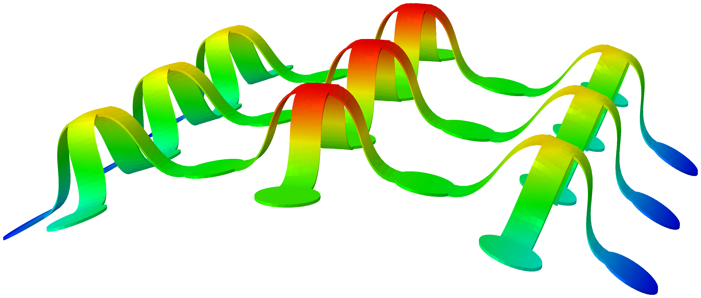
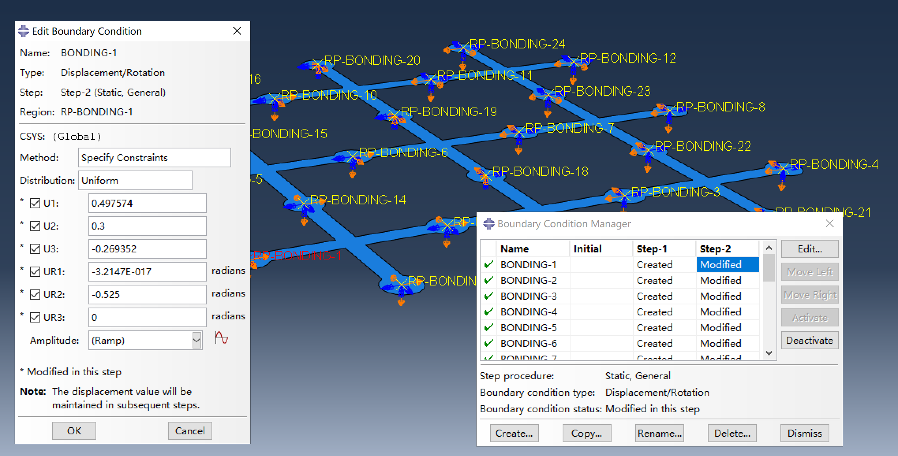
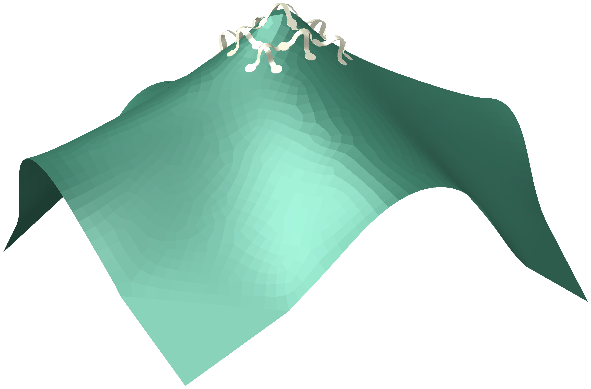
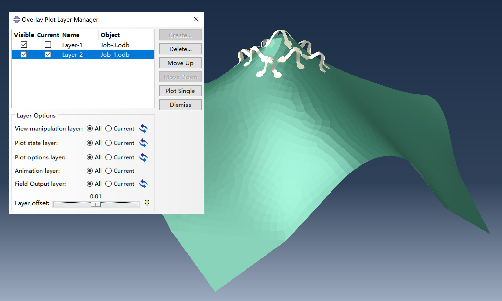

# Conforming assembled structures onto curved surfaces

Buckling-assembled 3D flexible structures can be conformed onto curved surfaces, which is important for applications in flexible electronics.



This simulation adds an extra step after the classical buckling assembly simulation: the bonding regions are first assembled on a flat surface, then gradually moved to their final positions on a curved surface.



As a best practice, this additional step is not included in `Model-2`. Instead, a separate job, `Job-3`, is created as a restart from `Job-2` of the classical buckling assembly simulation. This approach is useful when the substrate needs to conform to multiple different surfaces, as the first analysis step only needs to be performed once.

**Note:** In static analysis steps, Abaqus applies displacement boundary conditions using a **linear ramp** from the initial to the final positions by default. As a result, this added step does not capture the true physical process of conforming to a curved surface. For example, in reality, bonding regions conforming to a cylinder would follow involute trajectories, whereas in this simulation, the bonding regions move along straight lines. Therefore, the intermediate configurations are only approximate and do not represent the actual conforming process. For a more realistic simulation, consider using multiple analysis steps or customized amplitude functions in the boundary conditions to gradually move the bonding regions along the correct trajectories.

## Modeling workflow

There are two main scripts: `main-classical.py` for the classical buckling assembly simulation, and `main-curved.py` for applying displacement boundary conditions to conform the structure onto a curved surface.

The `main-curved.py` script requires a data file named `bonding_disp.txt`, which provides the displacement and rotation for each bonding region. This file follows this format:

```plain
# Bonding regions displacement data file
#
# This file specifies the displacement and rotation for each bonding region
# listed in `bonding.txt`, in the same order.
#
# Each line corresponds to a bonding region and contains:
#
#   {U1} {U2} {U3} {UR1} {UR2} {UR3}
#
#   where (U1, U2, U3) are displacement components, and (UR1, UR2, UR3) are
#   rotational displacement components (in radians).

```
To generate the `bonding_disp.txt` file, you need to determine the displacement and rotation values for each bonding region as it moves from the flat to the curved surface. There are two main approaches:

- **Analytical calculation:** Use mathematical formulas to map each bonding region from its initial position on the plane to its final position on the curved surface (such as a cylinder or sphere). This method is suitable for simple surfaces where the transformation can be described analytically.

- **Discrete data interpolation:** For complex or irregular surfaces, such as surfaces obtained from finite element analysis simulations or experimental measurements, displacement and rotation values can be obtained by interpolating from a discrete deformation field of a point cloud.

    - **Example:** Structure with substrate subjected to poking

        

        This figure illustrates an overlay plot combining the deformed substrate and the assembled structure, each resulting from separate simulations. In the first simulation, the substrate (modeled using shell elements) is deformed by poking, and the nodal coordinates of its deformed configuration are extracted. Displacement and rotation values for the bonding regions are then obtained by interpolating these nodal coordinates. In the second simulation, these interpolated values are applied to the bonding regions of the structure, allowing it to conform to the deformed substrate.

        The `substrate_under_poking` directory contains a script for generating the FEA model of the poked membrane and extracting nodal coordinates.

To assist with both approaches, two Python scripts are provided:

- `generate_bonding_disp_analytic.py`: Computes displacements and rotations analytically using mapping with explicit mathematical expressions.

- `generate_bonding_disp_interpolate.py`: Interpolates displacement and rotation values based on a discrete deformation field of a point cloud.

You can adapt these scripts to your specific mapping needs. Both scripts output a `bonding_disp.txt` file in the correct format for use with `main-curved.py`.

### Preparation

1. Ensure all files needed for classical buckling assembly simulation are available (`precursor.dxf`, `bonding.txt`, and `disturbance.txt`).

2. Generate `bonding_disp.txt` file. Either `generate_bonding_disp_analytic.py` or `generate_bonding_disp_interpolate.py` can be used to assist with this step.

3. Adjust parameters in both scripts as needed.

### Steps

1. Perform the classical buckling assembly simulation by executing `main-classical.py`, then submit `job_1.inp` and `job_2.inp` from the command line.

    Ensure that the `MY_MODEL_2_ENABLE_RESTART` parameter in `main-classical.py` is set to `True`.

2. Use `main-curved.py` to generate `Job-3`. In Abaqus CAE, select **File > Run Script** and choose the script. This will create the restart model `Model-3` and write its input file `job_3.inp`.

    For step-by-step interactive modeling, you can rename `main-curved.py` to `abaqusMacros.py` and execute its functions through the Macro Manager in Abaqus CAE.

3. Since `Job-3` is a restart from `Job-2`, there is no need to modify its input file. You can submit it either by clicking the "Submit" button in the Abaqus CAE job manager or through command line:

    ```bash
    abaqus job=Job-3 oldjob=Job-2
    ```

## Visualizing the conformed structure and curved surface

To display both the assembled structure and the target curved surface together in Abaqus CAE:

1. Switch to the **Visualization** module in Abaqus CAE.

2. Open the output database (`.odb`) files for both the conformed structure and the curved surface.

3. Select **View > Overlay Plots** to overlay the two models in the same viewport. For more details on using the overlay feature, refer to the Abaqus documentation.


