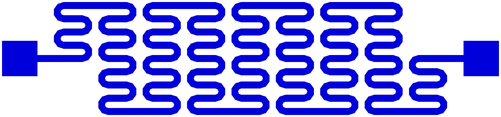
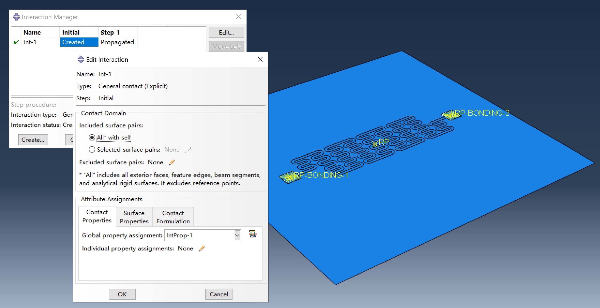
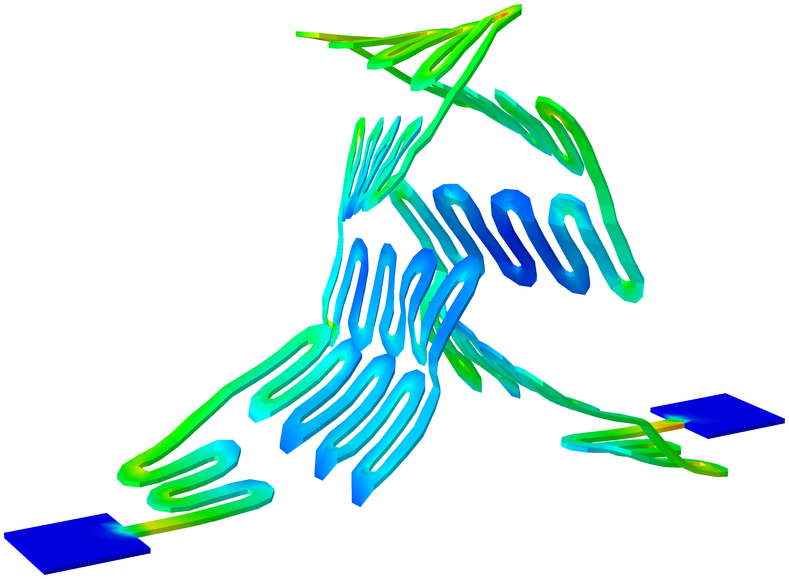

# Buckling assembly of ultra-flexible structures

Ultra-flexible structures are extremely difficult to assemble due to their very low stiffness, which can also cause convergence issues in FEA when using implicit analysis. Achieving convergence in such analyses is almost impossible, and even automatic stabilization provides only limited improvement. Although Riks analysis steps are commonly used to address instability, they are still insufficient for handling the buckling of ultra-flexible structures.

- **Typical ultraflexible structure precursor**

  

- **Assembled ultraflexible structure**

  

As a result, explicit dynamics analysis is often used to simulate the assembly of ultra-flexible structures because it avoids the convergence issues. Additionally, explicit dynamics excels at handling contact interactions. By positioning a rigid plate beneath the structure and defining contact interactions between the structure and the plate, the structure can buckle naturally when displacement boundary conditions are applied to the bonding regions, without the need for external disturbance.



However, using explicit dynamics analysis to simulate static problems can be computationally expensive, especially for models with many elements. Explicit dynamics requires very small time increment for numerical stability, while static analysis needs quasi-static loading conditions. The simulation time is mainly determined by the smallest element size and the total number of elements. Several techniques can be employed to speed up the assembly process:

- **Virtual topology**: This technique simplifies the mesh by merging small geometric features, avoiding the creation of very small elements that would significantly slow down the simulation.

- **Mass scaling**: This technique artificially increases the mass of the structure, allowing for larger time increment. The simulation time decreases with the square root of the mass scaling factor (for example, a 100x mass scaling factor results in a 10x speedup). However, using a large mass scaling factor can introduce oscillations during assembly, which can be reduced by using **Rayleigh damping**.

- **Rayleigh damping**: This technique helps reduce oscillations resulting from mass scaling. The Rayleigh damping coefficients usually need to be adjusted through trial and error to effectively suppress oscillations while still allowing the structure to assemble properly.

Even with these acceleration techniques, assembling ultra-flexible structures remains a lengthy process. Simple models with a few thousand elements may require several hours to simulate, while larger models with tens of thousands of elements can take days or even weeks. Such simulations often involve more than 200,000 step increments and may need **double precision** to achieve reliable results. Using single precision can sometimes produce very strange configurations.

- **Results with single precision**

  

In practice, the primary interest is usually the deformed 3D shape of the structure after assembly, rather than the stress distribution. For most applications, a coarse mesh with a few thousand elements provides sufficiently accurate displacement results, even though the stress results may not be reliable.

## Modeling workflow

1. Prepare the main script `main-ultraflexible.py`.

2. Prepare the required input files: `precursor.dxf` and `bonding.txt`. A disturbance file is not required for this model.

3. Edit the main script to configure parameters for the assembly process. Adjust options such as the mass scaling factor, Rayleigh damping coefficients, and meshing settings to balance assembly speed and accuracy.

4. Run the main script to generate Abaqus input files, or rename the script to `abaqusMacros.py` for interactive modeling using Abaqus Macro Manager.

5. Submit the generated `Job-1.inp` file either via the command line or by clicking "Submit" in the Abaqus CAE job manager.

    **Note:** Double precision is not enabled by default in the script. To enable double precision, use one of the following methods:

    - **Command line:**  

      ```bash
      abaqus job=Job-1 double=both
      ```

    - **Abaqus CAE job manager:**  

        In the job settings dialog, go to the **Precision** tab and select "Double - Analysis + Packager" for Abaqus/Explicit Precision.
