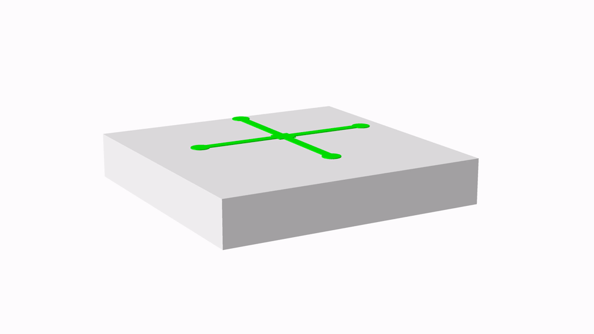
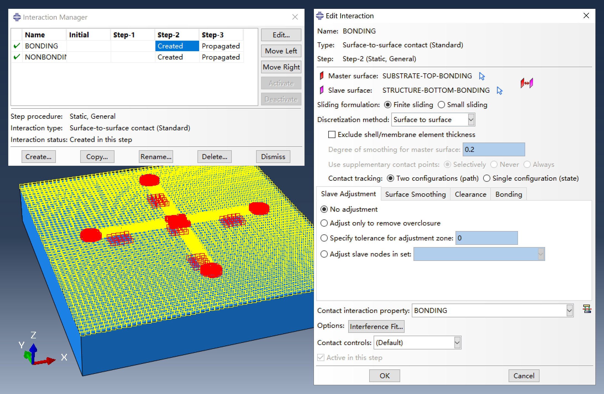
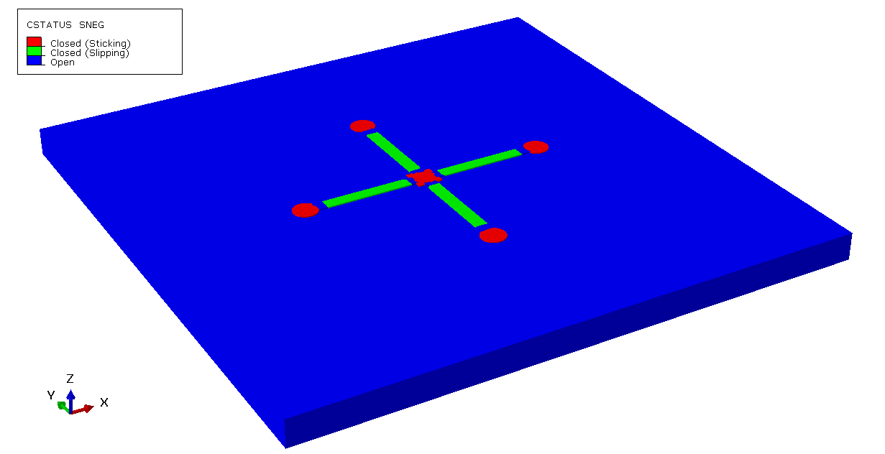
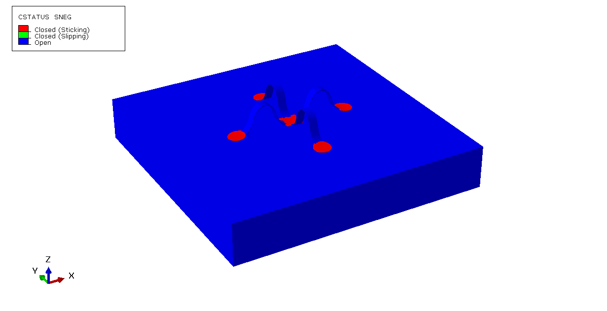
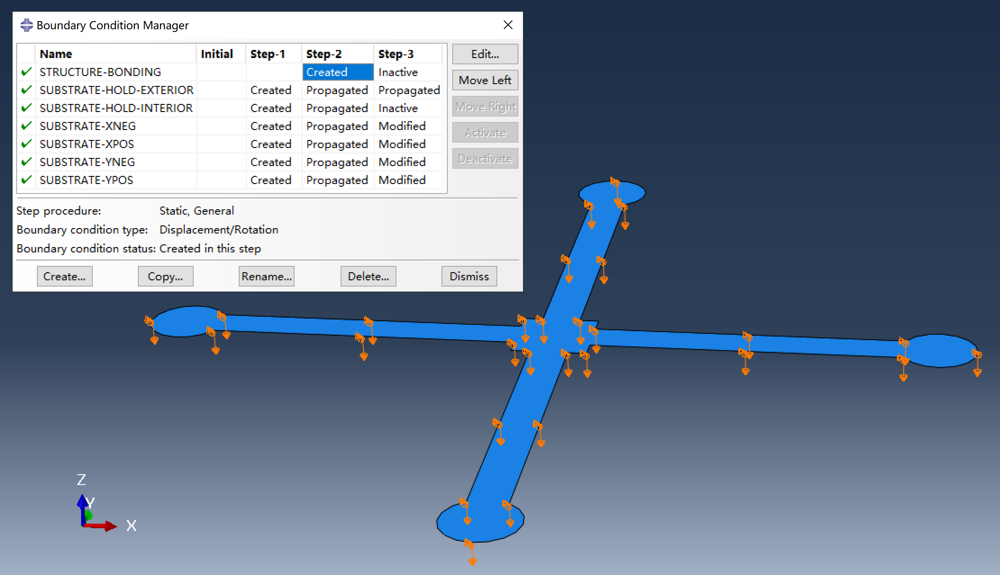
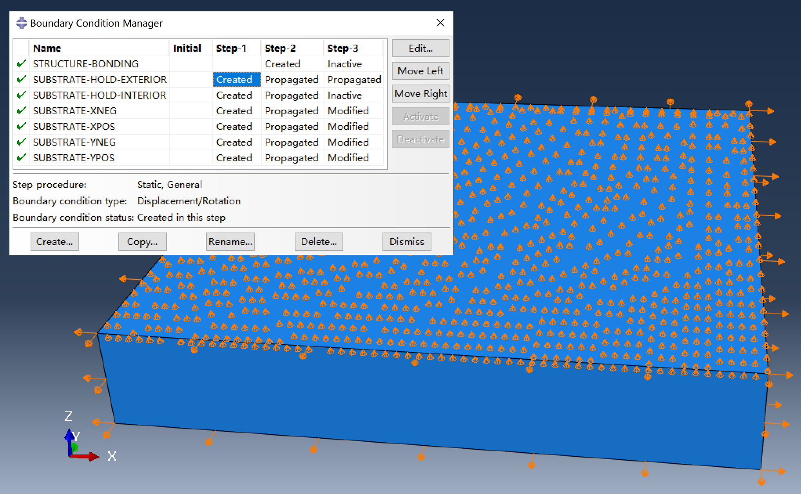

# Substrate-included buckling assembly simulation

This simulation method includes the substrate as part of the model, providing a more accurate representation of the assembly process. Compared to classical buckling assembly simulations, it requires additional meshing for the substrate and setup of contact interactions, increasing the model's complexity and computational requirements. Nevertheless, with the use of automation scripts, the workflow remains as straightforward as in the classical approach.

The FEA model consists of a hyperelastic substrate and a structure, which is initially placed just above the substrate with a small gap. The simulation comprises three steps:

1. **Step-1:** Pre-stretch the substrate to a specified prestrain.

2. **Step-2:** Press the bonding regions of the structure onto the substrate.

3. **Step-3:** Establish contact interactions between the substrate and the structure. Release the prestrain in the substrate, allowing the structure to buckle and self-assemble.

## Details of the simulation

### Hyperelastic substrate

The substrate is modeled as a Neo-Hookean solid. In the script, the Neo-Hookean coefficient $C_{10}$ is determined by the elastic modulus of the substrate, and the volumetric coefficient $D_1$ is set to zero, indicating that the substrate is incompressible. Hybrid elements (C3D8RH, C3D6H, or C3D4H) are used for the substrate to account for this incompressibility.

### Contact interactions

Two distinct contact interactions are defined in the simulation:

1. **Bonding regions:**  
    - **Normal behavior:** Hard contact, separation not allowed after contact.  
    - **Tangential behavior:** Rough.

2. **Non-bonding regions:**  
    - **Normal behavior:** Hard contact, separation allowed after contact.  
    - **Tangential behavior:** Frictionless.

The top surface of the substrate and the corresponding surface of the structure are each divided into complementary sets representing bonding and non-bonding regions. Contact interactions are assigned between matching sets on the structure and substrate. Since the substrate is pre-stretched before bonding, the bonding region on the substrate is determined based on the applied prestrain during model setup.

- **Contact status (structure side) at the beginning of Step-3**

    

- **Contact status (structure side) at the end of Step-3**

    

Note that the contact interaction is established in `Step-3`. This approach helps the contact detection work correctly. If the contact interaction is defined in `Step-2`, Abaqus may sometimes fail to detect contact between the structure and the substrate, since the structure can attach to the substrate within a single time increment, potentially causing the contact algorithm to miss the interaction.

### Displacement boundary conditions

- **Displacement boundary conditions of the structure**

    

- **Displacement boundary conditions of the substrate**

    

Three groups of displacement boundary conditions are applied in the simulation:

1. **Substrate pre-stretch and release**

    The substrate is pre-stretched by applying a displacement boundary condition in `Step-1` to the side faces of the substrate, This BC is set to zero in `Step-3` to release the prestrain.

2. **Bonding the structure to the substrate**

    In `Step-2`, the structure is pressed downward onto the substrate. At the beginning of `Step-3`, the contact interaction is established between the substrate and the structure. The displacement boundary condition is then removed.

3. **Controlling substrate motion and ensuring contact**

    The **exterior** edges of the substrate's top surface are constrained with `u3=0` throughout all steps to prevent rigid body motion along the z-axis. Additionally, the **interior** nodes of the substrate's top surface are fixed at `u3=0` during `Step-2`, ensuring that all nodes in the bonding region of the structure meet the substrate. In `Step-3`, this constraint on the interior top surface is removed, allowing these nodes to move freely.

### Step increment controls

Because no external disturbance is applied to the structure, the assembly step (`Step-3`) can be difficult to converge initially. The minimum time increment should be set to a small value (e.g., 1e-10) to allow the solver to use smaller increments during the assembly process.

## Modeling workflow

1. Prepare the main script `main-with_substrate.py`.

2. Prepare the required input files: `precursor.dxf` and `bonding.txt`. A disturbance file is not required. **Note** that this simulation is not compatible with rotatable bonding regions, so the `bonding.txt` file should not contain any `ROTATABLE` keywords.

3. Edit the main script to configure parameters for the assembly process.

4. Run the main script to generate Abaqus input files, or rename the script to `abaqusMacros.py` for interactive modeling using Abaqus Macro Manager.

5. Submit the generated `Job-1.inp` file either via the command line or by clicking "Submit" in the Abaqus CAE job manager.
