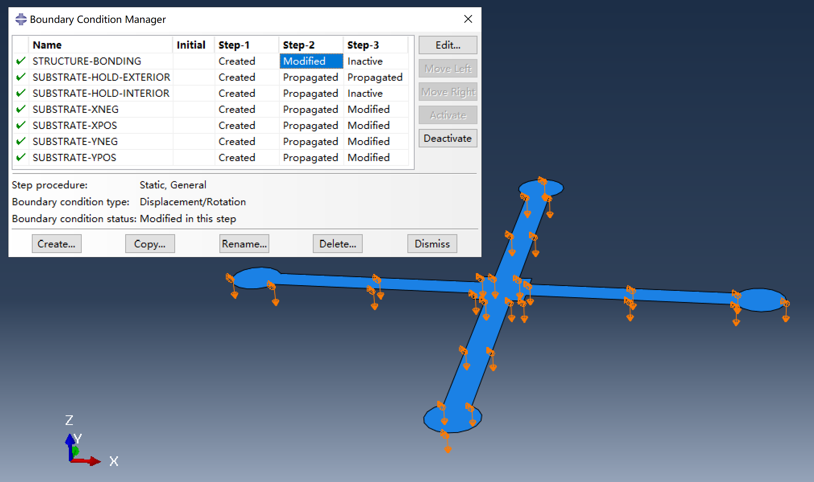

# Substrate-included buckling assembly simulation

This simulation method includes the substrate as part of the model, providing a more accurate representation of the assembly process. Compared to classical buckling assembly simulations, it requires additional meshing for the substrate and setup of contact interactions, increasing the model's complexity and computational requirements. Nevertheless, with the use of automation scripts, the workflow remains as straightforward as in the classical approach.

This simulation uses implicit static analysis, which is generally efficient and provides acceptable convergence in most cases. However, convergence issues may still arise. For particularly challenging scenarios, try explicit dynamic analysis, although it can be significantly slower. A discussion of the explicit method for such simulations can be found in [Buckling assembly with cohesive behavior](../cohesive/README.md).

The FEA model consists of a hyperelastic substrate and a structure, which is initially placed just above the substrate with a small gap. The simulation comprises three steps:

1. **Step-1:** Pre-stretch the substrate to a specified prestrain.

2. **Step-2:** Press the bonding regions of the structure onto the substrate.

3. **Step-3:** Establish contact interactions between the substrate and the structure. Release the prestrain in the substrate, allowing the structure to buckle and self-assemble.

## Details of the simulation

### Hyperelastic substrate

The substrate is modeled as a Neo-Hookean hyperelastic material. In the script, the Neo-Hookean parameter $C_{10}$ is calculated based on the elastic modulus, while the parameter $D_1$ is set according to the bulk modulus, which is determined from the Poisson's ratio (specified as 0.49 for near-incompressibility).

Because the material is nearly incompressible, hybrid elements are used for the substrate to account for incompressibility. Additionally, because the elements surrounding the bonding region can undergo large distortions, it is recommended to use reduced-integration, first-order elements, as described in the Abaqus documentation on *Solid (continuum) elements*. As a result, the substrate is meshed with C3D8RH, C3D6H, or C3D4H elements in the script.

### Contact interactions

This simulation uses surface-to-surface contact. Two contact pairs are defined: the top surface of the substrate and the bottom surface of the structure are each split into complementary sets for the bonding and non-bonding regions. Contact interactions are then assigned between the corresponding sets on the structure and substrate. Because the substrate is pre-stretched before bonding, the bonding region on the substrate should correspond to its initial (undeformed) configuration. The bonding region of the substrate is automatically determined in the script based on the specified prestrain.

Note that the contact interaction is established in `Step-3`. This is a workaround to help the contact detection work correctly. If the contact interaction is defined in `Step-2`, Abaqus may sometimes fail to detect contact between the structure and the substrate, since the structure can attach to the substrate within a single iteration, potentially causing the contact algorithm to miss the interaction.

The interaction properties for the bonding region are **hard contact with separation NOT allowed after contact** as the normal behavior, and **rough** as the tangential behavior. Note that rough contact can make convergence difficult, and Abaqus will always issue a warning about this in the DAT file.

While cohesive behavior can be a good alternative to rough contact, it has limitations in implicit analysis. Specifically, cohesive behavior is not compatible with general contact (standard), and it requires a continuous bonding region for each surface-to-surface contact definition. For these reasons, rough contact is used here for simplicity.

The interaction properties for the non-bonding region are **hard contact with separation allowed after contact** as the normal behavior, and **frictionless** as the tangential behavior. Incidentally, if tangential behavior is not defined in the interaction property, Abaqus uses frictionless contact by default. However, the script explicitly specifies frictionless tangential behavior for clarity.

The contact status can be output and visualized. Remember to select `CSTATUS` in the field output request for `Step-3`. The following images show the contact status at the beginning and end of `Step-3`:

- **Contact status (structure side) at the beginning of Step-3**

    

- **Contact status (structure side) at the end of Step-3**

    

### Displacement boundary conditions

- **Displacement boundary conditions of the structure**

    

- **Displacement boundary conditions of the substrate**

    

Three groups of displacement boundary conditions are applied in the simulation:

1. **Substrate pre-stretch and release**

    The substrate is pre-stretched by applying a displacement boundary condition in `Step-1` to the side faces of the substrate, This BC is set to zero in `Step-3` to release the prestrain.

2. **Bonding the structure to the substrate**

    In `Step-2`, the structure is pressed downward onto the substrate. At the beginning of `Step-3`, the contact interaction is established between the substrate and the structure. The displacement boundary condition is then removed.

3. **Controlling substrate motion and ensuring contact**

    The **exterior** edges of the substrate's top surface are constrained with `u3=0` throughout all steps to prevent rigid body motion along the z-axis. Additionally, the **interior** nodes of the substrate's top surface are fixed at `u3=0` during `Step-2`, ensuring that all nodes in the bonding region of the structure meet the substrate. In `Step-3`, this constraint on the interior top surface is removed, allowing these nodes to move freely.

### Step increment controls

Because no external disturbance is applied to the structure, the assembly step (`Step-3`) can be difficult to converge initially. The minimum time increment should be set to a small value (e.g., 1e-10) to allow the solver to use smaller increments during the assembly process.

Convergence issues can be frustrating. If you have tried all possible solutions and still cannot achieve convergence, consider switching to explicit analysis as described in [Buckling assembly with cohesive behavior](../cohesive/README.md).

## Modeling workflow

1. Prepare the main script `main-with_substrate.py`.

2. Prepare the required input files: `precursor.dxf` and `bonding.txt`. A disturbance file is not required. **Note** that this simulation is not compatible with rotatable bonding regions, so the `bonding.txt` file should not contain any `ROTATABLE` keywords.

3. Edit the main script to configure parameters for the assembly process.

4. Run the main script to generate Abaqus input files, or rename the script to `abaqusMacros.py` for interactive modeling using Abaqus Macro Manager.

5. Submit the generated `Job-1.inp` file either via the command line or by clicking "Submit" in the Abaqus CAE job manager.
