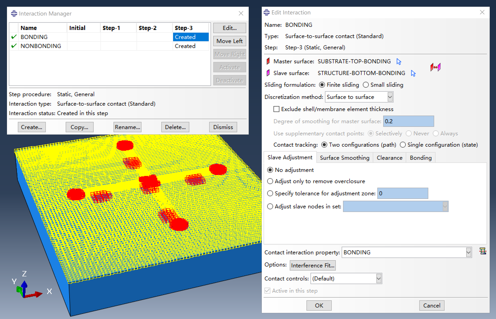
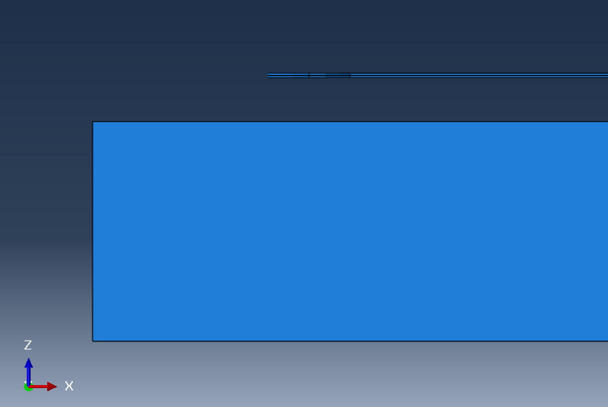
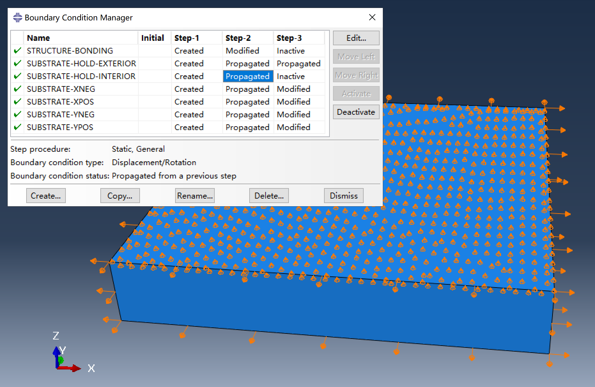

# Substrate-included buckling assembly simulation

This simulation method includes the substrate as part of the model, providing a more accurate representation of the assembly process. Compared to classical buckling assembly simulations, it requires additional meshing for the substrate and setup of contact interactions, increasing the model's complexity and computational requirements. Nevertheless, with the use of automation scripts, the workflow remains as straightforward as in the classical approach.

The FEA model consists of a hyperelastic substrate and a precursor, which is initially placed just above the substrate with a small gap. The simulation comprises three steps:

1. **Step-1:** Pre-stretch the substrate to a specified prestrain.

2. **Step-2:** Press the bonding regions of the precursor onto the substrate to bring them into contact, forming adhesion.

3. **Step-3:** Release the prestrain, allowing the precursor to buckle and self-assemble.

## Details of the simulation

### Hyperelastic substrate

The substrate is modeled as a Neo-Hookean solid. In the script, the Neo-Hookean coefficient $C_{10}$ is determined by the elastic modulus of the substrate, and the volumetric coefficient $D_1$ is set to zero, indicating that the substrate is incompressible. Hybrid elements (C3D8RH, C3D6H, or C3D4H) are used for the substrate to account for this incompressibility.

### Contact interactions

Two distinct contact interactions are defined in the simulation:

1. **Bonding regions:**  
    - *Normal behavior:* Hard contact, separation not allowed after contact.  
    - *Tangential behavior:* Rough.

2. **Non-bonding regions:**  
    - *Normal behavior:* Hard contact, separation allowed after contact.  
    - *Tangential behavior:* Frictionless.

The top surface of the substrate and the corresponding surface of the precursor are each divided into complementary sets representing bonding and non-bonding regions. Contact interactions are assigned between matching sets on the precursor and substrate. Since the substrate is pre-stretched before bonding, the bonding region on the substrate is determined based on the applied prestrain during model setup.

- **Contact status between the precursor and substrate after Step-2**

    

- **Contact status between the precursor and substrate after Step-3**

    

### The initial gap between precursor and substrate

The precursor is initially positioned above the substrate, separated by a small gap defined by the parameter `MY_DISTURBANCE_SCALE_FACTOR`. In the simulation, this gap is often referred to as the "disturbance." 

During `Step-2`, displacement boundary conditions are applied to move the bonding regions of the precursor downward by the initial gap, bringing them into contact with the substrate. At the same time, a separate displacement boundary condition, named "disturbance," is applied to specific non-bonding nodes of the precursor (as specified in the `disturbance.txt` data file), keeping them at their original height (`u3=0`) above the substrate.

As a result, after the bonding step, the bonding regions are pressed onto and bonded with the substrate, while the specified non-bonding nodes remain at their original height above the substrate. The height difference between these two regions corresponds to the initial gap. At the end of `Step-2` (which is also the beginning of `Step-3`), the structure is in a disturbed configuration, with the disturbance level equal to the initial gap -- hence the use of the term "disturbance" for this gap.

### Displacement boundary conditions

- **Displacement boundary conditions of the precursor**

    

- **Displacement boundary conditions of the substrate**

    

Three groups of displacement boundary conditions are applied in the simulation:

1. **Substrate pre-stretch and release**

    The substrate is pre-stretched by applying a displacement boundary condition in `Step-1` to the side faces of the substrate, This BC is set to zero in `Step-3` to release the prestrain.

2. **Bonding the precursor to the substrate**

    In Step 2, two displacement boundary conditions are applied to the precursor:  

    - The bonding regions are moved downward to contact the substrate.  

    - The non-bonding nodes specified in data file `disturbance.txt` are held at their initial height above the substrate.  
    Both conditions are deactivated in Step 3.

3. **Controlling substrate motion and ensuring contact**

    The exterior edges of the substrate's top surface are constrained with `u3=0` throughout all steps. This prevents rigid body motion along the z-axis. Additionally, the interior nodes of the substrate's top surface are also fixed at `u3=0` throughout `Step-2`, ensuring that all nodes in the bonding region of the precursor achieve proper contact with the substrate. In `Step-3`, this constraint on the interior top surface is removed, allowing them to move freely.

## Modeling workflow

1. Prepare the main script `main-with_substrate.py`.

2. Prepare the required input files: `precursor.dxf`, `bonding.txt`, and `disturbance.txt`. **Note** that this simulation does not allow rotatable bonding regions, so the `bonding.txt` file should not contain any `ROTATABLE` keywords. **Additionally**, there is only one disturbance level in the simulation, which is specified in `main-with_substrate.py`, so the `disturbance.txt` file should contain only the disturbance coordinates.

3. Edit the main script to configure parameters for the assembly process.

4. Run the main script to generate Abaqus input files, or rename the script to `abaqusMacros.py` for interactive modeling using Abaqus Macro Manager.

5. Submit the generated `Job-1.inp` file either via the command line or by clicking "Submit" in the Abaqus CAE job manager.
